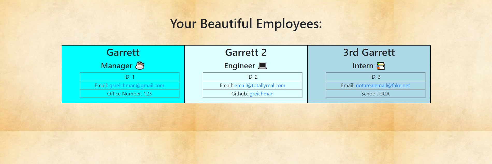

# team-profile-generator
Garrett Reichman

## Description
I developed this application to practice object oriented programming. It contains several classes and utilizes inheritance to use these classes to create a business heirarchy. It uses this heirarchy to create a page of team members based on user input.
## Usage

 To use this application, run the command "node app.js" while in the project folder. When prompted, answer "y" to create a new team member. Answer the series of questions regarding the team member you are trying to add, then choose if you would like to add another team member or create the file. The team must contain exactly 1 manager, but can have any number of engineers and interns. Once you are finished adding team members, answer "n" to the inital prompt and the file will be available in the output folder.

 